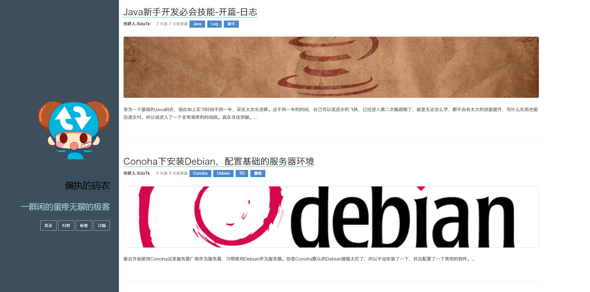

# Ink主题-Pure

这是一个参考 Yahoo Pure设计的主题，适用于 `纸小墨` 静态博客系统使用。

## 下载地址
`纸小墨` http://www.inkpaper.io/index-zh.html

`主题` https://github.com/Xdatk/ink-pure

## 预览地址
http://leftcoding.com

## 使用说明

### 第一步

下载本主题，复制到`blog`目录下

### 第二步

更改`config.yml`下的主题选项`theme: pure`

### 第三步

更改下面的文件为自己的

| `文件`  |   `功能`   |   `描述`   |
| :-------- | --------:| :------: |
| `_ad.html`|   广告文件|  更改为自己的广告内容，随便更改|
| `_commnet.html`|   回复插件 |  目前我使用的是`友言`，大家可以自己去申请一个|
| `_footer.html`|   页足 |  添加自己的友情链接去吧  |
| `_share.html`|   分享 |  复制自己的分享组件吧，CSS样式自己看着修改吧  |
| `_header.html`|   菜单栏 |  如果不需要添加，就别修改了  |

### 第四步
渲染，预览，上传